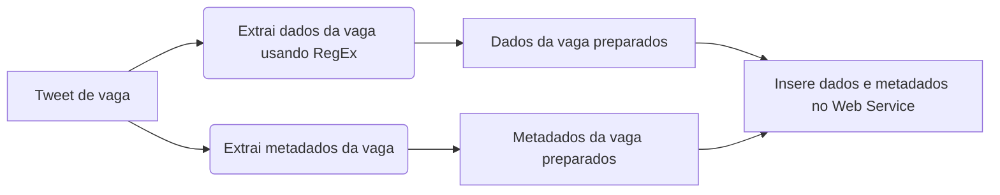

```mermaid
graph LR
    A[Tweet de vaga] --> B(Extrai dados da vaga usando RegEx)
    A --> C(Extrai metadados da vaga)
    B --> D[Dados da vaga preparados]
    C --> E[Metadados da vaga preparados]
    D --> F[Insere dados e metadados no Web Service]
    E --> F
```
